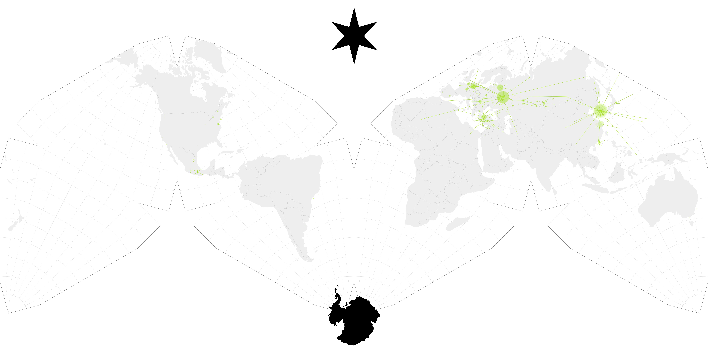

{::nomarkdown}

{:/}

# Andor Seasons 1 and 2

## Graphs

{::nomarkdown}

{:/}

## Maps

<!-- Preload the CSS without blocking rendering -->
<link rel="preload" href="../resources/izzi-table-wcag-22.css" as="style" onload="this.onload=null;this.rel='stylesheet'">

<!-- Fallback for users who have JavaScript disabled -->
<noscript>
  <link rel="stylesheet" href="../resources/izzi-table-wcag-22.css">
</noscript>





## Tables

<!-- Preload the CSS without blocking rendering -->
<link rel="preload" href="../resources/izzi-table-sort-wcag-22.css" as="style" onload="this.onload=null;this.rel='stylesheet'">

<!-- Fallback for users who have JavaScript disabled -->
<noscript>
  <link rel="stylesheet" href="../resources/izzi-table-sort-wcag-22.css">
</noscript>





## Commentary, Questions

### What percentage of viewers are from the USA?

#### Synthetic week 5 USA-only results

Nielsen methodology uses 35 day measurements of select USA-only data feeds. This can be approximated with Alpha60 swarm data by using 5 week USA only swarm results. How does this then compare to global or 15/26 week USA samples?

The table previously (see USA-only results [table](https://alpha60-devops.github.io/alpha60-results-star-wars-universe/docs/swu.html)) shows that for the first five weeks of the media
object andor-210-211-212, the downloads from the USA are roughly 1
million, the rest of the world roughly 13 million, showing that
only 9% of all peers are "from" the USA. This shows the danger of
relying on a USA-centric data slice to see the global audience.

Furthermore, if one takes the longer duration of twenty weeks, the USA
slice deteriorates further: downloads from the USA are 3.8M, the
rest of the world is 47.6M, only 8% of all peers are "from" the
USA. When comparing 5 week to 20 week results, 1.2M USA to 47.6M or
slightly over 2% of all peers measured.

#### Top Downloads by Country

The top seven countries for andor-112-2022 are:



The top seven countries for andor-112-2025 are:



### Long Duration and the Shape of Streaming Serialization

Streaming platforms often pose as affordances where the media objects
will be always-on, forever available, the idea of potential watch times
creating a horizon of infinite opportunities. Forever! In practice,
the longevity of media on a streaming platform is less certain. (See
Westworld and HBO, as one instance).

But what about peer swarms, not platforms? They turn out to be more
durable. Andor Season 1 was released in 2022, and Season 2 was
released in 2025. At each event, peer to peer swarms were sampled for
26 weeks. The season's two swarms can be compared for size, locality, etc.

And what about Andor as a series of two seasons? To gain some insight,
while Andor Season 2 was being sampled, the last episode of Season 1
(112) was re-sampled. So there are two sample data sets for Andor 112,
with the exact same inputs (BTIHA is the same): one from 2022 and one
from 2025, about two and a half years later.

The number of downloaders for this experiment are in the chart and tables above.

#### Size Differences

  - Season two last episodes swarm < first episodes swarm.
  - In the context of 2022 (as immediate past COVID-19 lock down), similar results to contemporaneous shows like Obi-Wan Kenobi, Book of Boba Fett.
  - Season two opener 4x higher swarm count than Season one opener.
  - Season two last episodes swarm > first episodes swarm.

The later sample is 3x original viewing.

#### Size Differences Normalized for ITU Growth

Given that the two samples occurred two and a half years apart, what's a good method to normalize the size of the internet in 2022 to the bigger internet in 2025?

The answer is to scale via data obtained from ITU(itu.int)
internet size and population estimates. Consulting official publications and synthesizing the data into a year index of scalable size. See ICT Development Index
(IDI) 2025 (and previous), ITU Facts and Figures, Global Connectivity
Report.  The estimated year-over-year internet population
growth from 2015 to 2025 can be found in the repository [JSON data file](/resources/facts_and_figures.json).

Using this technique, the multiple of 2022 to 2025 global internet
users is (6.0/5.3) or about 1.13, normalizing the number of downloaders from
2022's 5.8 million to 6.56 million 2025 equivalents.

Comparing these scaled 15-week numbers from 2022 to the resampled number of downloaders in 2025 (15 week is 21,282,679) indicates that interest in the same media object increased by a factor of 3.24 over two and a half years. Far from fair-weather friends, the extraordinary Andor fandom grew at a gigantic rate after the premiere season, only to explode by another multiple on top of this residual multiple during the second season.

#### Swarm IP Analysis

Swarm behavior over time can analyzed by repeated sampling over time. The sample swarms are then divided into three partitions: only in the
2022 sample, only in the 2025 sample, and in both samples (the intersection).



This one is a bit weird. Instead of anonymized results, the initial intersection work uses ip address information, with the hope that eventually the analytical methods can be improved and closely-correlated yet anonymous H3 hexagons can be used in the future.

These results indicate that 14% of the Andor 112 swarm was continuously
active in the swarm cluster from 2022 to 2025 (aka the 418,800
internet addresses (ip) in the two sample set's intersection over the 3 million and change ip original sample).

Fourteen percent continuity over two and a half years is far more than expected. (Expecting zero).
How many Disney+ users re-watch Andor once a year on the web-based official platform? (*Note HJ and Big say compare to non-resistance media here (Game of Thrones?) or have come kind of comparable*).



The other oddity here is the increase in each ip downloading more media objects than just one format. In 2022, the dl/ip ratio was 1.89, and in 2025 it was 3.04. This can be thought of as each ip downloading 1.89 versions or variants of the movie: one for phones (720p resolution) and one for the big flat panel display (maybe 4k resolution). The the variants can also include different languages or subtitles that the canonical streaming release, or special audio formats or video or audio codecs optimized for playback on lower-end hardware.

The why remains elusive here. One operating theory is that debrid front-ends are automatically downloading various resolutions by default. Or some distributed file system is being created by yet-unknown pirate technology using the Bittorrent protocol.

* Average may not mean anything for this distribution. Look at the histogram of values per ip instead. *

#### Geo Spatial/Temporal Analysis

Projecting IP-space on to specific geography, we find 96% of internet
addresses can be located via geolocation databases (Ipinfo.io).

Using the data set of IP addresses from the analysis above, transform
it to an aggregated datum tied to a specific geolocation (lat, long)
converted to a unique hexagon in a sphere of hexagons modling the
world. (See H3 Hexagon).

### Extrapolating to all episodes in a season from partial samples.

Only half of the episodes in Andor season two were sampled. Can the
missing episodes (204-206, 207-209) be approximated using data from
the first (201-203) and (210-212) episodes?

{::nomarkdown}
<svg width="100" height=100>
	<circle cx="20" cy="50" r="10" fill="black"/>
</svg>
{:/}
